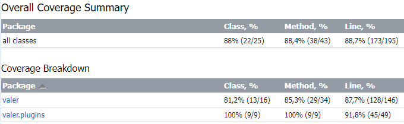
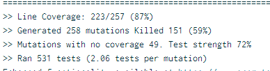

# BabyBlockchain
[](https://github.com/kechinvv/BabyBlockchain/actions/workflows/test.yml)

A simplified version of the blockchain as part of the course "Development of network applications"
## How to run
```
docker build -t baby-blockchain . 
docker-compose up 
```

## Example of work
Regular block generation
<p align="center">

</p>
Getting an up-to-date chain if the current node is behind
<p align="center">

</p>
## Tests

- [unit](https://github.com/kechinvv/BabyBlockchain/tree/master/src/test/kotlin/valer/unit) with JUnit
- [integration](https://github.com/kechinvv/BabyBlockchain/tree/master/src/test/kotlin/valer/integration) with JUnit
- system - manual
- [e2e](https://github.com/kechinvv/BabyBlockchain/tree/master/src/test/kotlin/valer/e2e) with Cucumber
- [load and stress](https://github.com/kechinvv/BabyBlockchain/tree/master/JMeter) with JMeter
- [mutation](https://scans.gradle.com/s/kckhiidjm3sws) with pitest in STRONGER mode



