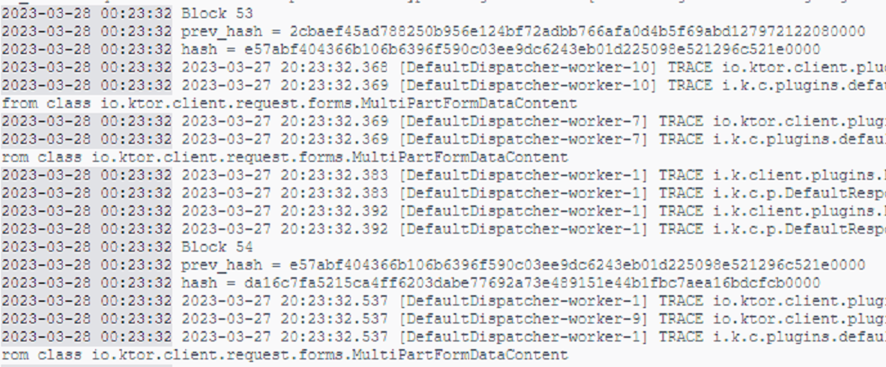
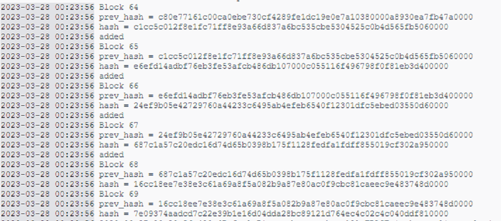

# BabyBlockchain
[](https://github.com/kechinvv/BabyBlockchain/actions/workflows/test.yml)

A simplified version of the blockchain as part of the course "Development of network applications"
## How to run
```
docker build -t baby-blockchain . 
docker-compose up 
```

## Example of work
Regular block generation
<p align="center">

</p>
Getting an up-to-date chain if the current node is behind
<p align="center">

</p>